# Artist Style Transfer CycleGAN

[](https://github.com/TienNHM/Artist-Style-Transfer-CycleGAN/graphs/contributors)
[](https://github.com/TienNHM/Artist-Style-Transfer-CycleGAN/issues)


[](https://github.com/TienNHM/Artist-Style-Transfer-CycleGAN/graphs/code-frequency)

[](https://github.com/TienNHM/Artist-Style-Transfer-CycleGAN/releases)

## Ngôn ngữ lập trình


## Công nghệ sử dụng
 

## Project Structure
<details>
<summary>Mở rộng</summary>

```
├───assets
├───checkpoints
│   ├───ce
│   ├───mo
│   ├───uk
│   └───vg
├───datasets
│   ├───cezanne2photo
│   │   ├───testA
│   │   ├───testB
│   │   ├───trainA
│   │   │   └───A
│   │   └───trainB
│   │       └───B
│   ├───monet2photo
│   │   ├───testA
│   │   ├───testB
│   │   ├───trainA
│   │   │   └───A
│   │   └───trainB
│   │       └───B
│   ├───ukiyoe2photo
│   │   ├───testA
│   │   ├───testB
│   │   ├───trainA
│   │   │   └───A
│   │   └───trainB
│   │       └───B
│   └───vangogh2photo
│       ├───testA
│       ├───testB
│       ├───trainA
│       │   └───A
│       └───trainB
│           └───B
├───images
└───out
```

</details>

## Datasets
Download vào thư mục `datasets\`:
- [Monet](https://people.eecs.berkeley.edu/~taesung_park/CycleGAN/datasets/monet2photo.zip)
- [Cezanne](https://people.eecs.berkeley.edu/~taesung_park/CycleGAN/datasets/cezanne2photo.zip)
- [Ukiyo-e](https://people.eecs.berkeley.edu/~taesung_park/CycleGAN/datasets/ukiyoe2photo.zip)
- [Vangogh](https://people.eecs.berkeley.edu/~taesung_park/CycleGAN/datasets/vangogh2photo.zip)

Lưu ý: sau khi download và giải nén, phải sửa cấu trúc thư mục theo định dạng:
```shell
datasets
└───vangogh2photo
    ├───testA
    ├───testB
    ├───trainA
    │   └───A
    └───trainB
        └───B
```

## Results
### Loss chart
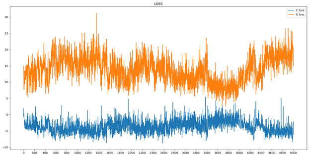

### Test

#### Test với pre-train
Với mỗi style ảnh (Cezanne, Monet, Ukio-e, Van Gogh), nhóm đem test với 4 ảnh và thu được kết quả như sau:

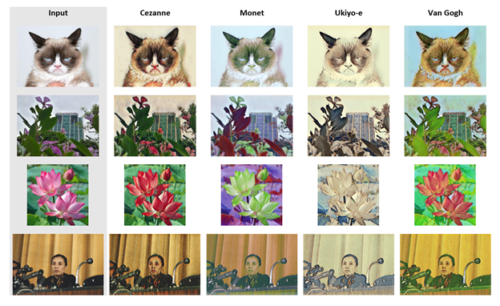

#### Test với model tự custom

<h4 align="center"><em>Danh sách các ảnh Input</em></h4>
<div align="center">
  <span>
    
  </span>
  <span>
    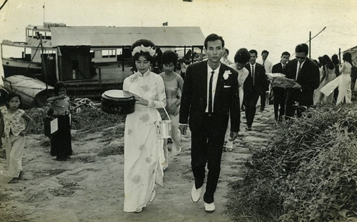
  </span>
</div>

<div align="center">
  <span>
    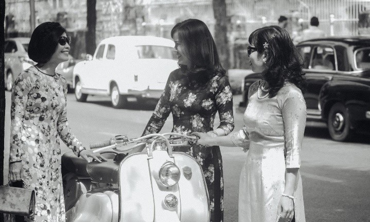
  </span>
  <span>
    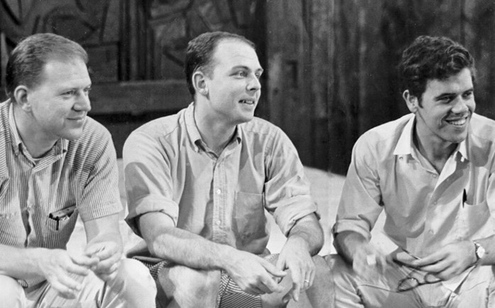
  </span>
</div>

Cứ 50 epoches trong tổng số 5000 epoches, nhóm sẽ lấy ra 1 checkpoint để test. Thu được kết quả như sau:

- Kết quả Test với ảnh Test 1 ứng với các epoch 0 – 5000 (step: 50):


<div align="center">
  <span>
    
  </span>
  <span>
    
  </span>
  <span>
    
  </span>
</div>
<div align="center">
  <span>
    
  </span>
  <span>
    
  </span>
  <span>
    
  </span>
</div>

- Kết quả Test với ảnh Test 2 ứng với các epoch 0 – 5000 (step: 50):


<div align="center">
  <span>
    
  </span>
  <span>
    
  </span>
  <span>
    
  </span>
</div>
<div align="center">
  <span>
    
  </span>
  <span>
    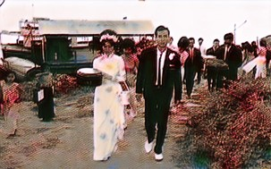
  </span>
  <span>
    
  </span>
</div>

- Kết quả Test với ảnh Test 3 ứng với các epoch 3000 – 4000 (step: 10):


<div align="center">
  <span>
    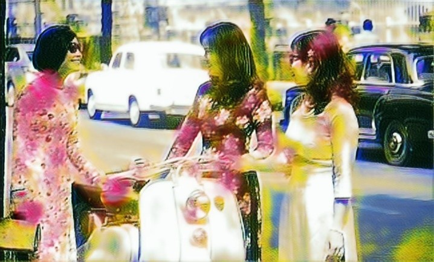
  </span>
  <span>
    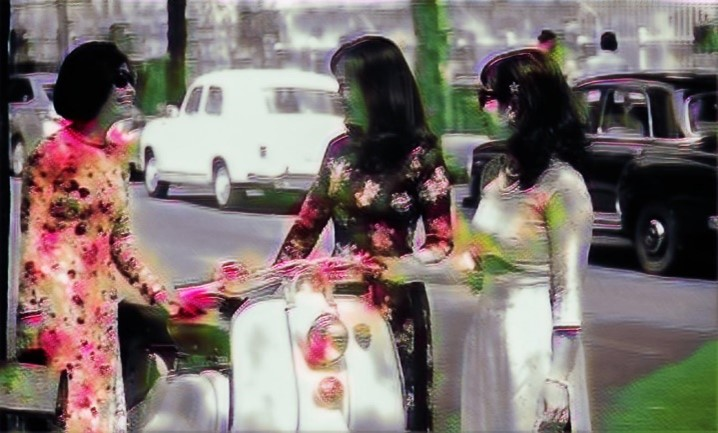
  </span>
  <span>
    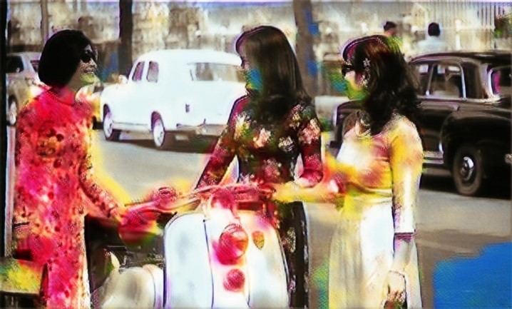
  </span>
</div>
<div align="center">
  <span>
    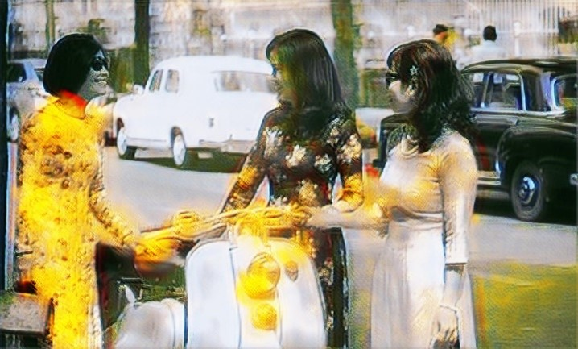
  </span>
  <span>
    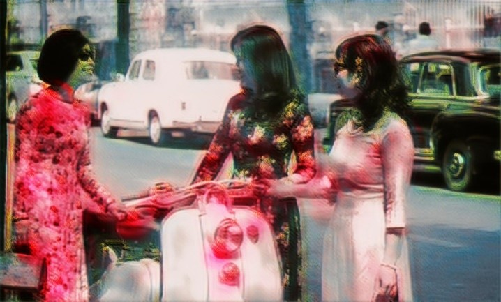
  </span>
  <span>
    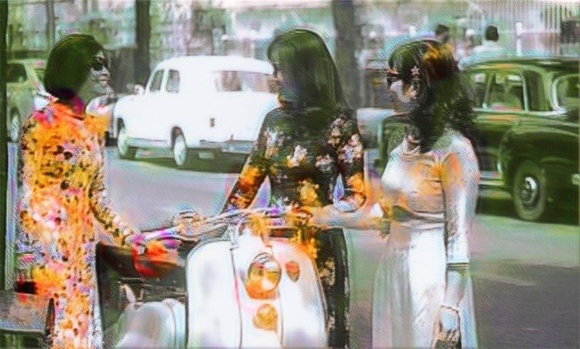
  </span>
</div>
<div align="center">
  <span>
    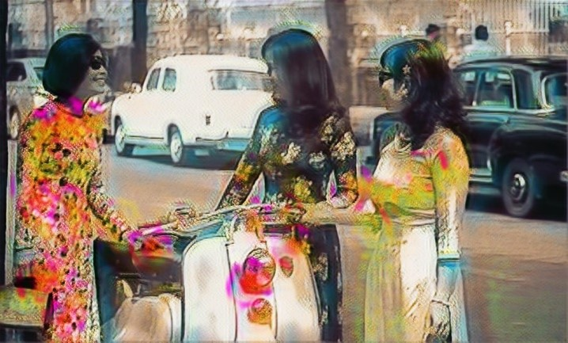
  </span>
  <span>
    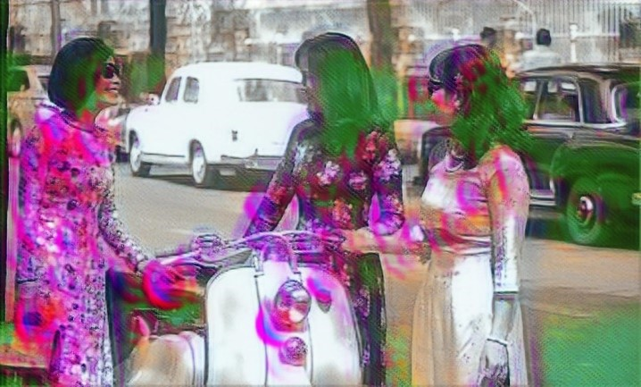
  </span>
  <span>
    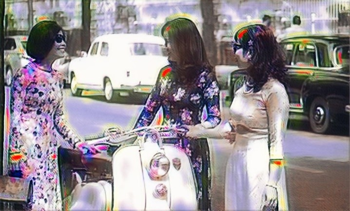
  </span>
</div>

- Kết quả Test với ảnh Test 4 ứng với các epoch 3000 – 4000 (step: 10):


<div align="center">
  <span>
    
  </span>
  <span>
    
  </span>
  <span>
    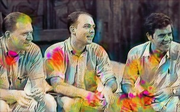
  </span>
</div>
<div align="center">
  <span>
    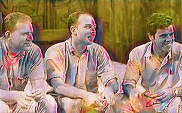
  </span>
  <span>
    
  </span>
  <span>
    
  </span>
</div>
<div align="center">
  <span>
    
  </span>
  <span>
    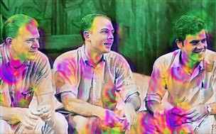
  </span>
  <span>
    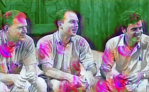
  </span>
</div>

## References
- [**Rahul Bhalley**](https://github.com/rahulbhalley) and [Jianlin Su](https://github.com/bojone)
- https://github.com/rahulbhalley/cyclegan-qp
